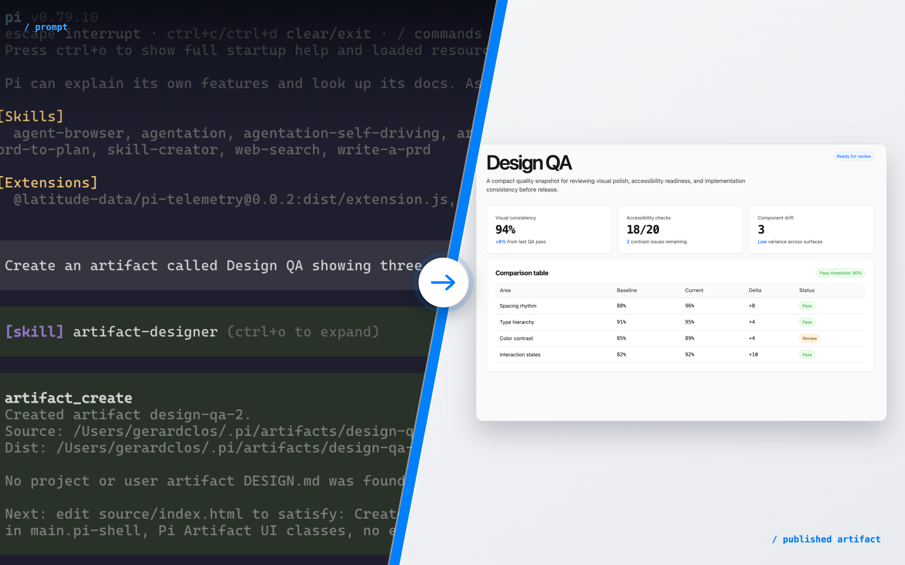
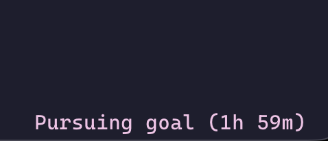

# pi-artifacts



Polished, shareable artifacts for [pi](https://github.com/badlogic/pi-mono).

`pi-artifacts` adds artifact tools, an `/artifact` command, and an `artifact-designer` skill so Pi can turn a prompt into a self-contained HTML report, dashboard, timeline, prototype, or walkthrough—then validate, preview, import, and publish it.



## Install

```bash
pi install npm:pi-artifacts
```

Or from a local checkout:

```bash
pi install ./path/to/pi-artifacts
```

For one session only:

```bash
pi -e ./path/to/pi-artifacts
```

## Usage

Ask Pi for a visual/shareable artifact:

```text
Create an artifact that explains this migration plan
Build a dashboard artifact from these benchmark results
Turn this PRD into a shareable timeline artifact
Make a diff walkthrough artifact for the current changes
```

Then manage artifacts from chat or the TUI:

```text
/artifact list
/artifact gallery
/artifact design
/artifact open <id>
/artifact validate <id>
/artifact publish <id>
```

Artifacts are stored in the current project under `.pi/artifacts/<id>/`.

## What it adds

- `artifact-designer` skill: generates polished, self-contained artifacts using the active design system
- `artifact_create`: scaffold an artifact in `.pi/artifacts/<id>/`
- `artifact_validate`: check self-contained runtime rules and Cloudflare temporary asset limits
- `artifact_preview`: serve a local preview and optionally open it
- `artifact_publish`: publish with Cloudflare Workers Static Assets, using no-signup temporary deployments by default
- `artifact_import_url`: import an existing public artifact/page for update and republish workflows
- `artifact_list`: list local artifacts and latest published URLs
- `artifact_open`: open a local preview or latest published URL
- `/artifact gallery`: browse artifacts with a simple TUI picker

## Flow

```text
User asks for an artifact
  -> Pi uses artifact_create to scaffold .pi/artifacts/<id>/source/index.html
  -> agent edits the source artifact with self-contained HTML/CSS/JS
  -> artifact_validate builds dist and checks publishing/runtime constraints
  -> artifact_preview opens a local URL for review
  -> artifact_publish deploys a public workers.dev URL when requested
```

## Artifact design system

`pi-artifacts` ships with **Pi Artifact UI**, a Geist-grounded design system inspired by Vercel's public design language. It favors crisp borders, clear hierarchy, restrained color, semantic HTML, and developer-focused components.

You can override the design system with Markdown—no config required:

```txt
.pi/artifacts/DESIGN.md              # project-specific, highest priority
~/.pi/agent/artifacts/DESIGN.md      # user default for all projects
```

First file found wins. Example:

```md
# Acme Artifact Design System

- Primary color: #635bff
- Cards use 14px radius and soft lavender borders
- Buttons are pill-shaped
- Dashboards are compact with metric cards first
- Avoid gradients
```

When an artifact is created or edited, the active design Markdown is injected into Pi's artifact guidance and recorded in `artifact.json` with its fingerprint.

## Publishing behavior

The default target is `cloudflare-temporary`.

Temporary publishing deliberately runs Wrangler with an isolated temporary home directory and without Cloudflare API environment variables, so it creates a no-signup temporary preview account even if the machine is already authenticated with Cloudflare. Temporary deployments expire after 60 minutes unless claimed.

Permanent publishing is available explicitly with `target: "cloudflare-permanent"`.

Before publishing, `artifact_validate` enforces the Cloudflare temporary limits:

- at most 1,000 files
- at most 5 MiB per asset
- no external runtime dependencies for generated artifacts

## Development

```bash
npm install
npm test
npm run typecheck
```

## License

MIT
